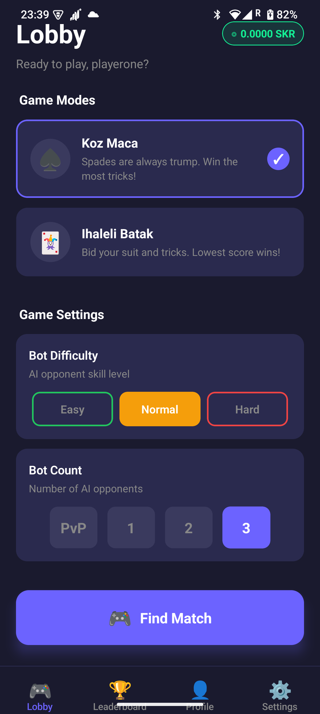
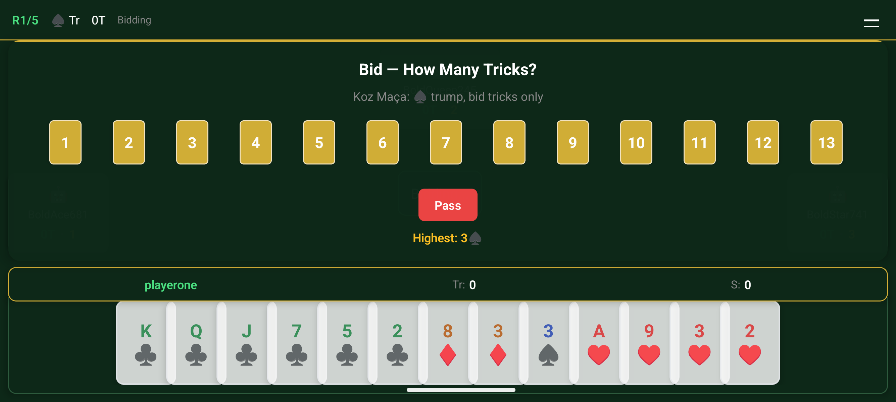
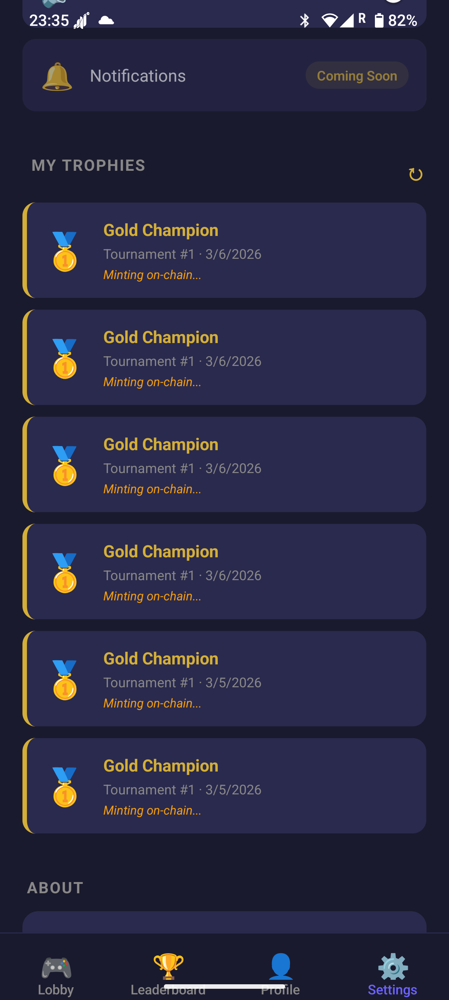
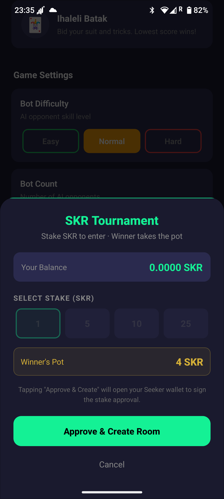

# Batak Tournament — CLOCK IN Solana Mobile Hackathon Submission

> **Turkish Trick-Taking Card Game · cNFT Trophies · SKR Staking · Seeker Wallet**

[](https://solanamobile.com/blog/clock-in-the-solana-mobile-hackathon)
[-green)](https://seeker.solana.com)
[](https://explorer.solana.com/?cluster=devnet)

---

## What is Batak?

Batak is the most popular card game in Turkey — a competitive trick-taking game for 4 players. Think of it as Turkey's answer to Spades, with complex bidding and high social stakes.

**Batak Tournament** brings it to Solana Mobile with:
- 🃏 **Full multiplayer** (humans + smart bots)
- 🏆 **cNFT trophies** minted to winners' wallets on Solana
- ◎ **SKR tournament rooms** — wallet-approved SKR stake per room (prototype; on-chain escrow is on the roadmap, see [Known limitations](#known-limitations))
- 👛 **Seeker wallet** via Mobile Wallet Adapter (one-tap login + tx signing)

---

## Why Solana? (The Pitch)

Traditional multiplayer games store achievements in their database. If the service shuts down, your trophies vanish.

**Batak Tournament solves this in three concrete ways:**

1. **Your wallet = your permanent identity.**
   One Seeker wallet works across any device. No account to create. Your game history is tied to your public key — not our database. Hardware-secured on Seeker.

2. **Your trophies are real digital assets.**
   When you win a tournament, you receive a **compressed NFT (cNFT)** on Solana. It's cryptographically yours — verifiable by anyone, survives even if Batak shuts down.

3. **SKR-staked tournament rooms.**
   Using Solana Mobile's native SKR token, a host can open a room with an SKR stake. The wallet approves the stake through Mobile Wallet Adapter. Trustless escrow and automatic payout of the pot are **not implemented yet** (roadmap).

---

## Demo Video

[](https://youtu.be/frwOmIqUAug)

---

## Screenshots

| Lobby | Gameplay | NFT Trophy | SKR Stake |
|-------|----------|------------|-----------|
|  |  |  |  |

---

## Try it

- **APK (signed release):** https://batakci.xyz/downloads/batak.apk
- **Web version:** https://game.batakci.xyz
- **Landing page:** https://batakci.xyz
- **Demo video:** https://youtu.be/frwOmIqUAug

---

## Solana Integration

| Feature | Status | Details |
|---------|--------|---------|
| MWA Login (any MWA wallet, incl. Seeker) | ✅ Live | `SeekerWalletService.authorize()`; server verifies an Ed25519-signed challenge |
| JWT Auth via wallet | ✅ Live | `auth_wallet` socket event; `publicKey` bound to the socket identity |
| cNFT minting (game win) | ✅ Live | Mainnet Bubblegum tree; enabled when `MERKLE_TREE` is set |
| Claim via MWA transaction | ✅ Live | Memo tx on devnet proves ownership |
| NFT Gallery (Settings) | ✅ Live | Shows trophies with Solscan links |
| SKR balance display | ✅ Live | Mainnet SPL token query |
| SKR tournament rooms | ⚠️ Prototype | MWA-signed approval → room creation. Stake amount and transaction are **not verified on-chain by the server**; no escrow/payout yet |
| Solana Program (Anchor) | ✅ Devnet | `5ZdgoyBDknoZ8tDYMDXf8zCUQ7FxuaDbK4QffAgSfA9h` (not used for SKR escrow yet) |

---

## Tech Stack

| Layer | Technology |
|-------|-----------|
| **Mobile** | React Native 0.81 + Expo 54 + TypeScript + Socket.IO Client |
| **Wallet** | `@solana-mobile/mobile-wallet-adapter-protocol-web3js` |
| **Server** | Node.js + TypeScript + Express + Socket.IO |
| **Blockchain** | Solana (devnet for game/auth, mainnet for cNFTs and SKR balance) + Anchor + Metaplex Bubblegum |
| **Token** | SKR — `SKRbvo6Gf7GondiT3BbTfuRDPqLWei4j2Qy2NPGZhW3` (mainnet) |
| **Database** | SQLite (game history, NFT rewards, auth) |

---

## Quick Start

### Prerequisites

- Node.js 18+
- Android device with [Seeker wallet](https://seeker.solana.com) (or emulator)
- ADB for device connection

### 1. Clone & Install

```bash
git clone https://github.com/mesahin001/batak
cd batak

# Server
cd server && npm install

# Mobile
cd ../mobile && npm install
```

### 2. Configure Environment

```bash
# server/.env
cp server/.env.example server/.env
```

Edit `server/.env`:
```env
PORT=3001
JWT_SECRET=your-secret-here
SOLANA_RPC_URL=https://api.devnet.solana.com
SOLANA_PRIVATE_KEY=      # Optional: funded devnet keypair for cNFT minting
MERKLE_TREE=             # Optional: run 'npm run setup-tree' to create one
NFT_STORAGE_KEY=         # Optional: free key from https://nft.storage
PROGRAM_ID=5ZdgoyBDknoZ8tDYMDXf8zCUQ7FxuaDbK4QffAgSfA9h
```

```bash
# mobile/.env
EXPO_PUBLIC_SOCKET_URL=http://YOUR_LOCAL_IP:3001
```

### 3. Run

```bash
# Terminal 1: Start server
cd server && npm run dev

# Terminal 2: Start mobile (Expo)
cd mobile && npm start
# Press 'a' for Android
```

### 4. Connect Physical Device

```bash
adb reverse tcp:8081 tcp:8081   # Metro
adb reverse tcp:3001 tcp:3001   # Game server
```

---

## Enable Real cNFT Minting (Optional)

To mint actual compressed NFTs to winners:

1. **Create a devnet wallet and fund it:**
   ```bash
   solana-keygen new -o server/wallet.json
   solana airdrop 2 $(solana-keygen pubkey server/wallet.json) --url devnet
   ```

2. **Export the private key** and set in `.env`:
   ```env
   SOLANA_PRIVATE_KEY=[1,2,3,...] # JSON array from wallet.json
   ```

3. **Create a Merkle tree:**
   ```bash
   cd server && npm run setup-tree
   # Outputs: MERKLE_TREE=<address> — add this to .env
   ```

4. **(Optional) Get a free nft.storage API key** at https://nft.storage and set `NFT_STORAGE_KEY` for real IPFS metadata hosting.

When `MERKLE_TREE` is configured, cNFT minting activates automatically at game completion.

---

## Game Modes

| Mode | Rules | Winning |
|------|-------|---------|
| **Koz Maça** | Spades always trump; bid trick count | Highest cumulative score |
| **İhaleli Batak** | Bid suit + amount; must beat current high bid | First to ≤1 points wins |

**Scoring:** Made bid → `10×bid + (tricks−bid)`. Failed → `−10×bid`.

---

## Architecture

```
Mobile (React Native)
  ↓ Socket.IO WebSocket
Server (Node.js + TypeScript)
  ├── GameStateMachine  ← all game logic, server-authoritative
  ├── Matchmaker        ← queue, private rooms, SKR rooms
  ├── CNFTMinter        ← Bubblegum compressed NFT minting
  └── DatabaseManager   ← SQLite (stats, NFTs, auth)
  ↓ on game complete
Solana
  └── mintCompressedNft (mainnet Bubblegum tree) → winner's wallet
```

**Player identification:** Seeker wallet `publicKey`, not socket ID. Reconnects are seamless.

---

## APK Build

```bash
# Embed the JS bundle, then build a signed release APK
cd mobile && npx expo export:embed --platform android --entry-file index.ts \
  --bundle-output android/app/src/main/assets/index.android.bundle \
  --assets-dest android/app/src/main/res
cd android && ./gradlew assembleRelease   # needs a keystore in gradle.properties

# Debug build / install on device
./gradlew assembleDebug
adb install -r app/build/outputs/apk/debug/app-debug.apk
```

---

## Project Structure

```
batak/
├── server/
│   ├── src/
│   │   ├── game/           # GameStateMachine, TurnValidator, Scoring
│   │   ├── socket/         # SocketServer, event handlers
│   │   ├── matchmaker/     # Queue, private rooms, SKR rooms
│   │   ├── solana/         # CNFTMinter, SolanaClient
│   │   ├── database/       # SQLite schema, queries
│   │   └── auth/           # JWT + bcrypt
│   └── .env.example
├── mobile/
│   ├── src/
│   │   ├── screens/        # Lobby, GameRoom, Settings
│   │   ├── services/       # SeekerWalletService, SkrService
│   │   ├── components/     # SkrStakeModal, cards, UI
│   │   └── contexts/       # Auth, Wallet, Socket
│   └── android/
└── client/                 # Web client (React + Vite)
```

---

## Environment Variables

### Server (`server/.env`)

| Variable | Required | Description |
|----------|----------|-------------|
| `PORT` | Yes | Server port (default: 3001) |
| `JWT_SECRET` | Yes | JWT signing secret |
| `SOLANA_RPC_URL` | No | Devnet RPC (default: public endpoint) |
| `SOLANA_PRIVATE_KEY` | No* | Server wallet for minting (*required for real cNFTs) |
| `MERKLE_TREE` | No* | Bubblegum tree address (*required for real cNFTs) |
| `NFT_STORAGE_KEY` | No | nft.storage API key for IPFS metadata |
| `NFT_IMAGE_URI` | No | IPFS URI for trophy NFT image |
| `PROGRAM_ID` | No | Anchor program ID |

### Mobile (`mobile/.env`)

| Variable | Required | Description |
|----------|----------|-------------|
| `EXPO_PUBLIC_SOCKET_URL` | Yes | Server URL (`https://batakci.xyz` for production, e.g. `http://192.168.x.x:3001` locally) |
| `EXPO_PUBLIC_DEFAULT_BOT_COUNT` | No | Default bot count (0 = real players only) |

---

## Testing

```bash
# Server (136 tests, 9 files)
cd server && npm test

# Type check
cd server && npx tsc --noEmit
cd mobile && npx tsc --noEmit
```

---

## Known limitations

Being upfront about the current state:

- **SKR stakes are not trustless yet.** The wallet approves a stake via MWA, but the server does not verify the amount or the transaction on-chain, and there is no escrow or automatic payout of the pot. Do not attach real value to it until this is built.
- **Mixed networks.** Game and auth run against devnet; cNFT minting and the SKR balance read use mainnet.

---

## License

MIT — built for the [CLOCK IN Solana Mobile Hackathon](https://solanamobile.com/blog/clock-in-the-solana-mobile-hackathon).
